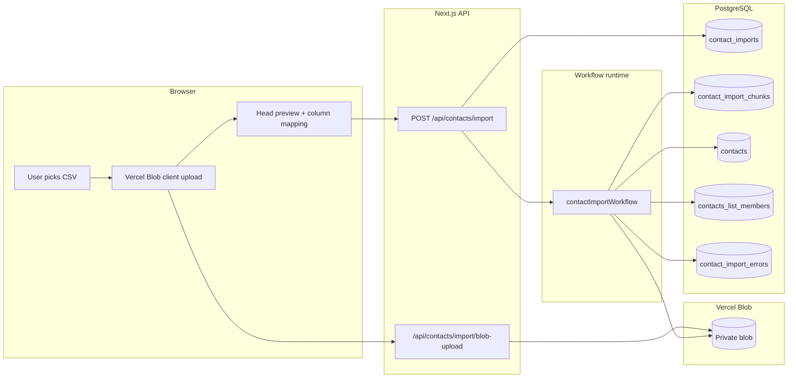
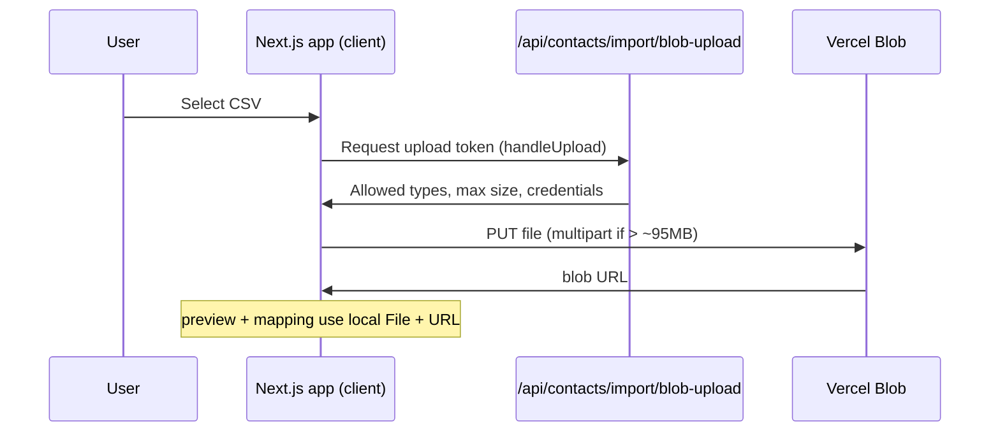
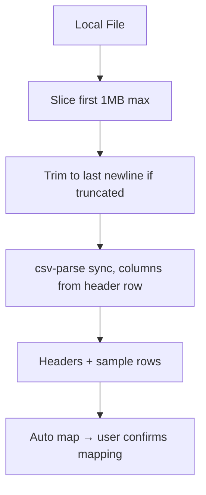
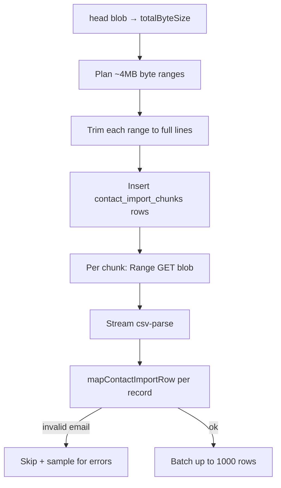
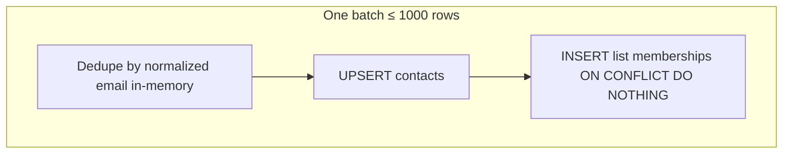

# Contact import architecture

This document describes how CSV contact files move from the browser into PostgreSQL: **upload**, **parsing**, and **database writes**. The main implementation lives in the import UI hooks, two API routes, and the `contactImportWorkflow` in `workflows/contact-import.ts`.

## End-to-end overview

---

## Upload strategy

Files never stream through your app server as the primary path. The browser uploads **directly to Vercel Blob** using `@vercel/blob/client`, with a short **token handoff** through a dedicated route so only signed-in users can obtain upload permission.

**Details:**

- **Route:** `app/api/contacts/import/blob-upload/route.ts` wraps `handleUpload` with session auth, allowed CSV-like content types, and a size cap (currently up to 1 GiB).
- **Client:** `app/dashboard/[listId]/import/_hooks/use-file-uploader.ts` calls `upload(..., { access: 'private', handleUploadUrl: '/api/contacts/import/blob-upload', multipart: file.size > 95MB })`.
- **What is stored:** Only the blob URL and metadata are sent when the user starts the job; the heavy bytes stay in object storage.

---

## Parsing strategy

Parsing is split into **two phases**: a small **client-side preview** for UX, and **server-side streaming** inside the workflow for the full file.

### Client: preview and column mapping

After upload, the app reads only the **first megabyte** of the local `File`, trims to the last complete newline (so rows are not cut mid-line), and parses with `csv-parse` in **sync** mode with `columns: true` so header names become keys. That yields headers and sample rows; column mapping is auto-detected and can be adjusted before import.

**Code:** `lib/csv/head.ts` (preview), column mapping helpers under `lib/csv/`.

### Server: chunked CSV over the blob

The workflow does **not** load the whole CSV into memory. It:

1. Gets **total byte size** via Vercel Blob `head()`.
2. **Plans chunks** (~4 MiB each), fetching each range and trimming to **row boundaries** (last `\n` inside the range). It records each chunk in `contact_import_chunks` with byte offsets and the **global first row number** for that chunk (for error reporting).
3. **Ingests** each chunk: HTTP **Range** fetch of the blob → `csv-parse` in **streaming** mode. The saved `columnMap` is turned into a fixed column list so each record is a `Record<string, string>` aligned with the user’s mapping.

**Code:** `workflows/contact-import.ts` (`prepareImport`, `planChunks`, `ingestChunk`).

**Row mapping:** `lib/csv/rows.ts` walks columns in mapping order, fills canonical fields (`email`, `first_name`, `last_name`) and `varyingFields` JSON. Invalid emails return `null` and the row is skipped (with reason).

---

## Database insert strategy

### Starting the job

`POST /api/contacts/import` (`app/api/contacts/import/route.ts`) inserts one `contact_imports` row (`ingestion_status: running`) with `listId`, `blobUrl`, `originalFilename`, `contentType`, and `columnMap`, then starts `contactImportWorkflow` via `start()` from `workflow/api`.

### Writes during ingestion

Each chunk runs as a **durable workflow step** (`'use step'`), so retries are possible. Within a chunk, rows are accumulated and flushed in batches of **1000**.

**Per batch (`flushBatch`):**

1. **Dedupe within the batch** by normalized email (last wins) to avoid useless conflicts in one statement.
2. **`INSERT ... ON CONFLICT DO UPDATE`** on `(tenant_id, email_normalized)` for `contacts` — same tenant + email updates name and `varying_fields`.
3. **`INSERT ... ON CONFLICT DO NOTHING`** into `contacts_list_members` for `(list_id, contact_id)` — idempotent if a step retries.

After each chunk completes, counters on `contact_imports` are incremented (`number_of_inspected_rows`, `number_of_ingested_rows`, `number_of_skipped_rows`). Skip samples are persisted to `contact_import_errors` in a separate step.

### Parallelism

Chunks are processed in **waves** of up to **4** concurrent chunk steps; a short pause between waves reduces bursts against Blob and Postgres.

**Observed in tests:** a **~100 MB** CSV with **~1 million rows** is split into **~26 chunks** (4 MiB byte ranges, trimmed to line boundaries). With four chunks per wave, that is seven ingestion waves plus the 1s pauses between them. End-to-end import time in those runs was **1m 33s** (upload and client preview excluded; workflow prepare → plan → ingest → complete only).

### Completion

When all chunks succeed, `completeImport` sets the import to `completed` and copies `columnMap` onto the parent `contacts_lists` row so the list remembers the schema of extra columns.

**Failure:** Fatal errors record a row in `contact_import_errors`, set `ingestion_status` to `failed`, and complete the workflow in an error path.
