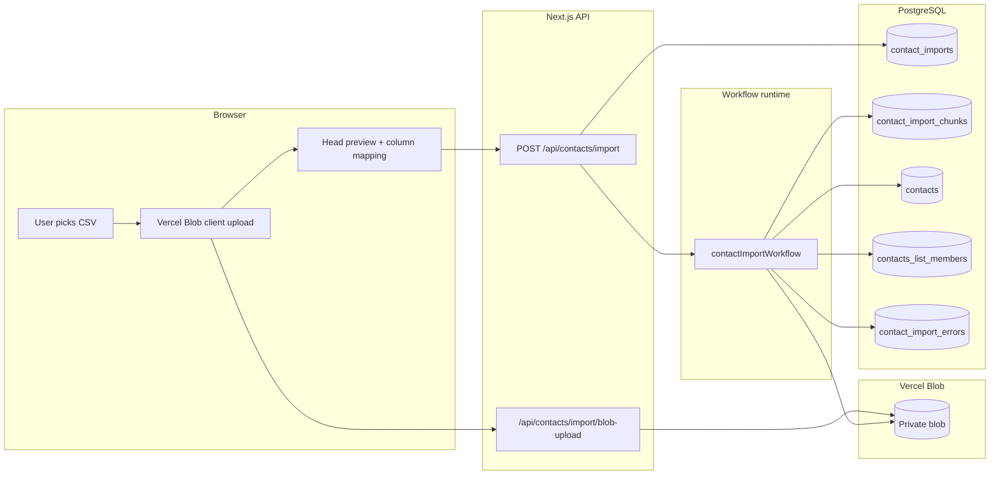
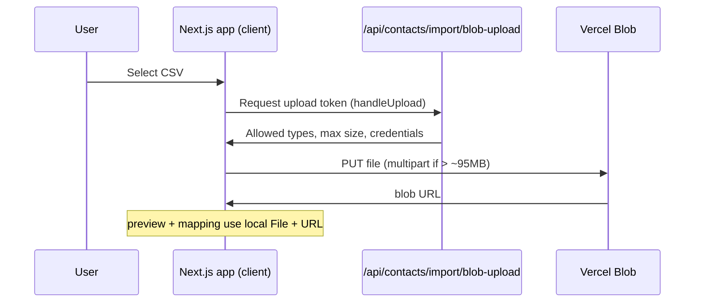
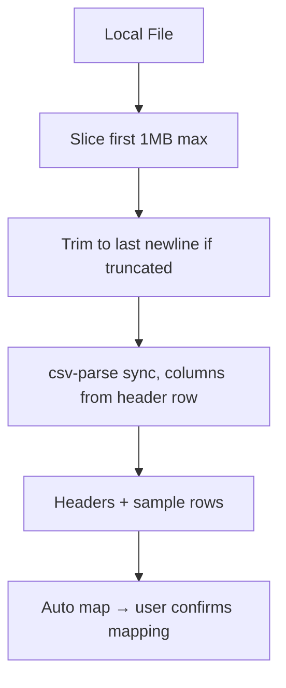
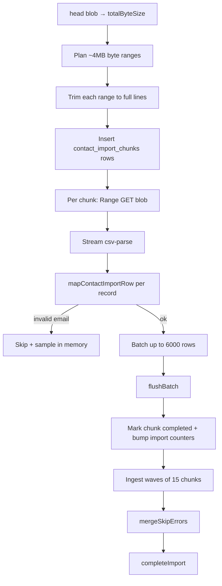
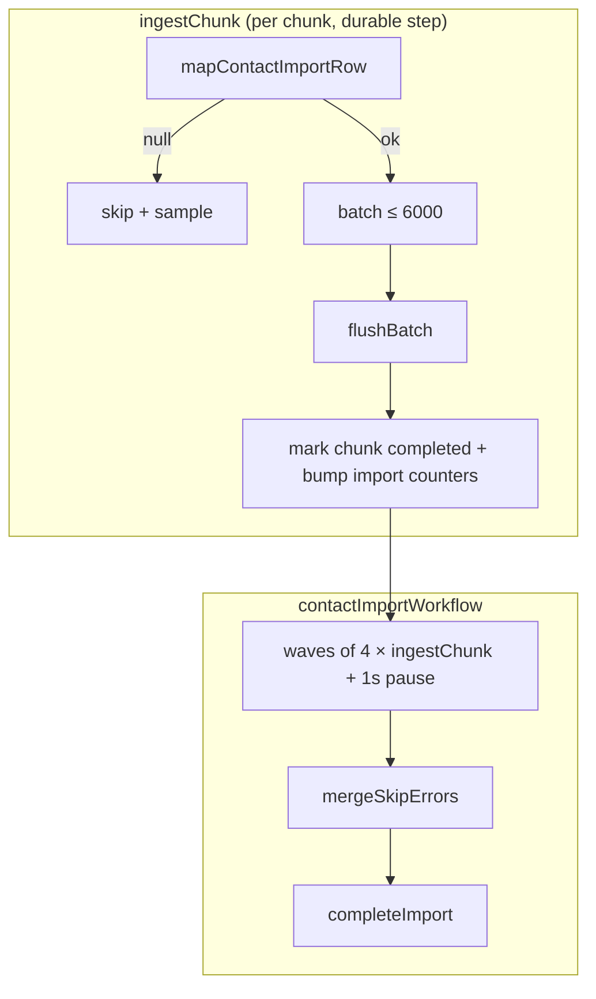
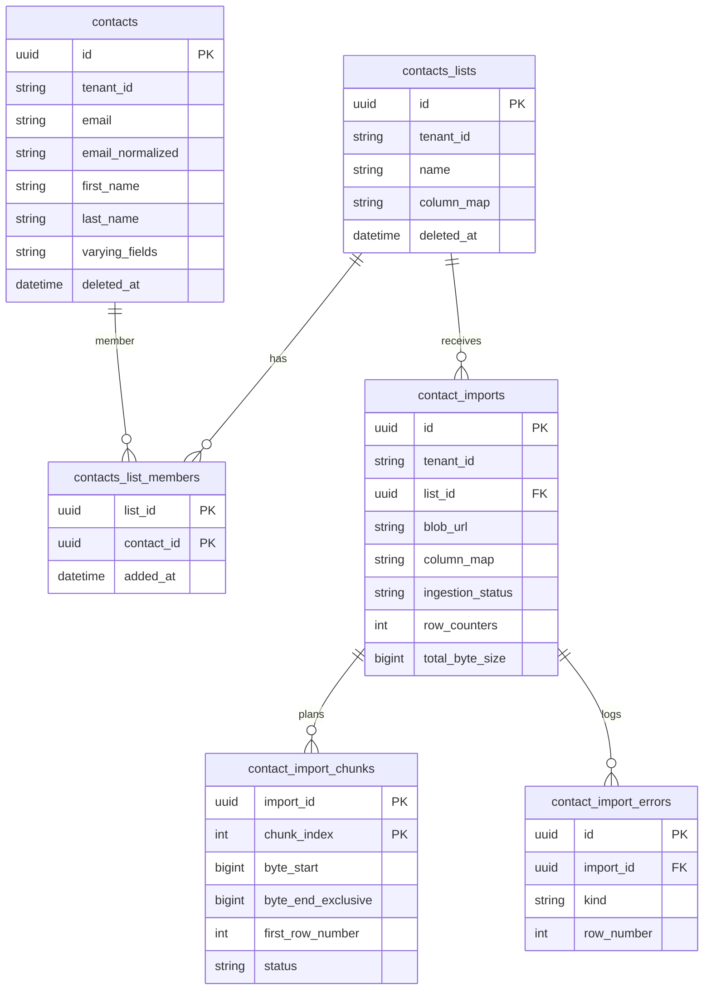

# Contact import architecture

This document describes how CSV contact files move from the browser into PostgreSQL: **upload**, **parsing**, and **database writes**. The main implementation lives in the import UI hooks, two API routes, and the `contactImportWorkflow` in `workflows/contact-import.ts`.

## End-to-end overview

---

## Upload strategy

Files never stream through your app server as the primary path. The browser uploads **directly to Vercel Blob** using `@vercel/blob/client`, with a short **token handoff** through a dedicated route so only signed-in users can obtain upload permission.

**Details:**

- **Route:** `app/api/contacts/import/blob-upload/route.ts` wraps `handleUpload` with session auth, allowed CSV-like content types, and a size cap (currently up to 1 GiB).
- **Client:** `app/dashboard/[listId]/import/_hooks/use-file-uploader.ts` calls `upload(..., { access: 'private', handleUploadUrl: '/api/contacts/import/blob-upload', multipart: file.size > 95MB })`.
- **What is stored:** Only the blob URL and metadata are sent when the user starts the job; the heavy bytes stay in object storage.

---

## Parsing strategy

Parsing is split into **two phases**: a small **client-side preview** for UX, and **server-side streaming** inside the workflow for the full file.

### Client: preview and column mapping

After upload, the app reads only the **first megabyte** of the local `File`, trims to the last complete newline (so rows are not cut mid-line), and parses with `csv-parse` in **sync** mode with `columns: true` so header names become keys. That yields headers and sample rows; column mapping is auto-detected and can be adjusted before import.

**Code:** `lib/csv/head.ts` (preview), column mapping helpers under `lib/csv/`.

### Server: chunked CSV over the blob w/ Vercel Workflow

The workflow does **not** load the whole CSV into memory. It:

1. Gets **total byte size** via Vercel Blob `head()`.
2. **Plans chunks** (~4 MiB each), fetching each range and trimming to **row boundaries** (last `\n` inside the range). It records each chunk in `contact_import_chunks` with byte offsets and the **global first row number** for that chunk (for error reporting).
3. **Ingests** each chunk: HTTP **Range** fetch of the blob → `csv-parse` in **streaming** mode. The saved `columnMap` is turned into a fixed column list so each record is a `Record<string, string>` aligned with the user’s mapping.

**Code:** `workflows/contact-import.ts` (`prepareImport`, `planChunks`, `ingestChunk`).

**Row mapping:** `lib/csv/rows.ts` walks columns in mapping order, fills canonical fields (`email`, `first_name`, `last_name`) and `varyingFields` JSON. Invalid emails return `null` and the row is skipped (with reason).

### After row mapping

Everything below runs inside `ingestChunk` and `contactImportWorkflow` (`workflows/contact-import.ts`). Constants: `BATCH_UPSERT_SIZE = 6000`, `PARALLEL_CHUNK_LIMIT = 15`.

> The batch limits `BATCH_UPSERT_SIZE` and `PARALLEL_CHUNK_LIMIT` are defined empirically to get the best trade-off between speed,memory efficiency, and DB provider limits.

#### Per record (inside `ingestChunk`)

For each row emitted by `csv-parse`, the chunk step increments `numberOfInspectedRows` and computes a **global row number** for error reporting:

`globalRowNumber = chunk.firstRowNumber + numberOfInspectedRows - 1`

(1-based across the whole file; `firstRowNumber` was set at plan time from newline counts in prior byte ranges.)

1. **Skip invalid rows** — If `mapContactImportRow` returns `null` (email fails the `decoders` check):
   - Increment `numberOfSkippedRows`.
   - Append `{ rowNumber: globalRowNumber, reason: 'Invalid email address' }` to in-memory `skipSamples`.
   - Do not batch or write the row.

2. **Batch valid rows** — Push the mapped row into an in-memory batch. When `batch.length >= 6000`, call **`flushBatch`**. After the stream ends, flush any remainder.

#### Per batch (`flushBatch`)

Each flush is two separate DB round-trips (Neon HTTP driver has no interactive transactions; each statement is still atomic).

1. **In-batch dedupe** — Key rows by `email.trim().toLowerCase()` in a `Map`; **last row wins** for the same normalized email within that batch (avoids duplicate keys in one `INSERT`).
2. **Upsert `contacts`** — `INSERT ... ON CONFLICT DO UPDATE` on `(tenant_id, email_normalized)`:
   - Insert: `tenantId`, `email`, `firstName`, `lastName`, `varyingFields`, `completedAt`.
   - On conflict: update `first_name`, `last_name`, `varying_fields`, `updated_at`.
   - `RETURNING id` for every row touched.
3. **Attach to list** — `INSERT` into `contacts_list_members` `(list_id, contact_id)` with `ON CONFLICT DO NOTHING` (safe on chunk retry).

`numberOfIngestedRows` for the chunk increases by `committed` (length of `RETURNING`). On DB error: `markImportAsFailed` then `FatalError`.

#### Per chunk (after the stream)

4. **Mark chunk completed (idempotent)** — Update `contact_import_chunks` only where `status = 'pending'`: set `completed`, per-chunk counters, `completedAt`. If zero rows updated (another execution already completed the chunk), re-read the chunk; if `completed`, return stored counters and **empty** `skipSamples` (no double-counting skips); otherwise fail.
5. **Roll up import counters** — If the chunk was newly completed, atomically add inspected / ingested / skipped counts to `contact_imports`.

The step returns chunk stats plus `skipSamples` for the orchestrator.

#### Orchestration (`contactImportWorkflow`)

Before ingestion, the workflow runs **`prepareImport`** (Blob `head()` → `totalByteSize` on `contact_imports`, idempotent if already set) and **`planChunks`** (~4 MiB byte ranges trimmed to `\n`, rows in `contact_import_chunks`; skipped if chunks already exist).

6. **Parallel ingest waves** — For each window of up to **15** chunk indices, `Promise.all(ingestChunk(...))`, merge `skipSamples`. If more chunks remain, **`sleep('1s')`** before the next wave.
7. **Persist skip samples** — If any samples were collected, **`mergeSkipErrors`**: sort by `rowNumber`, batch-insert into `contact_import_errors` (`kind: 'skip'`), touch `contact_imports.updated_at`. Fatal errors are not written here.
8. **Complete import** — **`completeImport`**: set `ingestion_status: completed`, `completedAt`; copy `columnMap` onto the parent `contacts_lists` row (non-deleted lists).

#### Idempotency and retries

| Unit            | Behavior                                                                                                      |
| --------------- | ------------------------------------------------------------------------------------------------------------- |
| `planChunks`    | Skips if any chunk row already exists (safe replay).                                                          |
| `ingestChunk`   | Skips work if chunk already `completed`.                                                                      |
| `flushBatch`    | Upsert + membership inserts are safe on chunk replay.                                                         |
| Import counters | Can drift by up to one batch (6000 rows) if a chunk retries after partial success; contact rows stay correct. |

**Failure:** Uncaught errors call `markImportAsFailed` (fatal row in `contact_import_errors`, message truncated to 8000 chars, `ingestion_status: failed`, `completedAt`), then re-throw. `flushBatch` and missing chunks can also fail the import directly.

---

## Database schema

**Source of truth:** `schema.ts` (Drizzle); migrations under `drizzle-migrations/`.

The schema separates **durable contact data**, **list membership**, and **import orchestration**. CSV bytes live in Blob storage, not in Postgres — the database only holds metadata, byte-range plans, counters, and the normalized rows you actually query.

### Entity model

Composite keys use multiple `PK` markers; FKs on those columns are implied by the relationships above. `email_normalized` is a generated column (`lower(trim(email))`); `column_map` / `varying_fields` are JSONB in Postgres.

### Tables (what each row represents)

| Table                       | Role                                                                                                                                                                                                            |
| --------------------------- | --------------------------------------------------------------------------------------------------------------------------------------------------------------------------------------------------------------- |
| **`contacts_lists`**        | Tenant-scoped named list (audience / folder). Stores `column_map` (JSON) so the UI can render dynamic columns after import. Soft-delete via `deleted_at`.                                                       |
| **`contacts`**              | **One row per person per tenant**, keyed by normalized email — not one row per list. Canonical columns (`email`, `first_name`, `last_name`) are real columns; extra CSV columns go in `varying_fields` (JSONB). |
| **`contacts_list_members`** | Many-to-many link: which contacts belong to which list. Composite primary key `(list_id, contact_id)`.                                                                                                          |
| **`contact_imports`**       | One job per uploaded CSV: blob URL, mapping snapshot, `ingestion_status`, and rolling counters (`number_of_inspected_rows`, `number_of_ingested_rows`, `number_of_skipped_rows`).                               |
| **`contact_import_chunks`** | One row per ~4 MiB byte range: offsets, global `first_row_number`, per-chunk counters, and `status` for idempotent workflow steps. Primary key `(import_id, chunk_index)`.                                      |
| **`contact_import_errors`** | One row per skip sample or fatal failure (replaces an earlier JSONB `errors` column on the import row). Indexed by `import_id` for pagination and UI.                                                           |

### Indexes and constraints that matter at scale

| Mechanism                                                                               | Purpose                                                                                                                                                     |
| --------------------------------------------------------------------------------------- | ----------------------------------------------------------------------------------------------------------------------------------------------------------- |
| **`contacts_tenant_email_normalized_uidx`** — unique on `(tenant_id, email_normalized)` | Makes each batch upsert a single indexed `INSERT … ON CONFLICT DO UPDATE`. Re-importing the same email updates the same row instead of creating duplicates. |
| **`email_normalized` GENERATED ALWAYS AS `lower(trim(email))` STORED**                  | Dedupe and conflict target are computed in the database; imports only set `email`.                                                                          |
| **`contacts_list_members` PK `(list_id, contact_id)`**                                  | Membership attach is `ON CONFLICT DO NOTHING` with no extra surrogate key or lookup.                                                                        |
| **`contacts_list_members_contact_idx`**                                                 | Supports joins and “which lists is this contact in?” from `contact_id`.                                                                                     |
| **`contacts_tenant_created_idx`**                                                       | Tenant-scoped list UIs ordered by `created_at`.                                                                                                             |
| **`contact_import_chunks_import_id_status_idx`**                                        | Fast “pending vs completed chunks” for a job.                                                                                                               |
| **`contact_import_errors_import_*_idx`**                                                | Load skip samples by import without scanning the whole `contacts` table.                                                                                    |
| **FK `ON DELETE CASCADE`**                                                              | Dropping an import or list cleans chunks, errors, and memberships automatically.                                                                            |

### Why this design handles millions of rows

The import path is optimized so **row volume grows in `contacts` and `contacts_list_members`**, while **job state stays small and write patterns stay bounded**.

1. **Canonical contacts, not per-list copies** — Importing 1M rows into one list writes at most 1M contact rows (often fewer after email dedupe) plus 1M membership rows, not 1M × N lists. The same person imported again on another list only adds a membership row; the body is upserted once per tenant + email.

2. **Fixed canonical columns + JSONB for the long tail** — `first_name`, `last_name`, and `email` stay indexable and simple; arbitrary CSV columns land in `varying_fields` without `ALTER TABLE` per import. `column_map` on the list records which JSON keys the UI should show.

3. **Blob outside Postgres** — A 100 MB / 1M-row file is read by range from object storage. Postgres stores ~26 chunk rows and counters, not the CSV payload.

4. **Chunked workflow state (O(chunks), not O(rows))** — Progress and retries are tracked per byte range (`contact_import_chunks`), not per CSV line. At 1M rows you get on the order of tens of chunk rows, not millions of state rows.

5. **Batched upserts (6000 rows per statement)** — Each flush is one multi-row `INSERT` + one membership `INSERT`, amortizing round-trips (important on Neon’s HTTP driver, which has no interactive transactions). In-batch email dedupe avoids intra-statement unique violations.

6. **Indexed upsert target** — Conflict on `(tenant_id, email_normalized)` turns “create or update contact” into a single planner-friendly unique-index probe per row in the batch, which is how Postgres sustains high ingest rates on large tables.

7. **Errors normalized into their own table** — Skip samples are inserted in batches of 6000 after ingestion, with indexes on `(import_id, row_number)`. That avoids a giant JSONB blob on `contact_imports` and keeps the hot import row narrow.

8. **Incremental counters** — `contact_imports` and each chunk store inspected / ingested / skipped counts updated. The UI reads one row instead of `COUNT(*)` over millions of contacts mid-import.

9. **Bounded parallelism** — 15 concurrent chunk steps limit write QPS to Postgres and Blob while still finishing ~1M rows in about **1m 33s** in workflow tests (see [Parallelism](#parallelism)).

10. **Idempotent membership** — `ON CONFLICT DO NOTHING` on `(list_id, contact_id)` makes chunk retries safe without duplicate memberships.

Together, these choices keep **memory flat** (stream + ~4 MiB ranges), **write amplification low** (upsert + skip-on-conflict membership), and **metadata proportional to file size in chunks**, not row count — which is what allows the same schema to serve large lists in the app (join `contacts_list_members` → `contacts` by `list_id`) while ingesting million-row files in minutes.

**Code:** `schema.ts`; ingest writes in `workflows/contact-import.ts` (`flushBatch`, `insertImportErrorEntries`).

---

## Database insert strategy

### Starting the job

`POST /api/contacts/import` (`app/api/contacts/import/route.ts`) inserts one `contact_imports` row (`ingestion_status: running`) with `listId`, `blobUrl`, `originalFilename`, `contentType`, and `columnMap`, then starts `contactImportWorkflow` via `start()` from `workflow/api`.

### Writes during ingestion

Each chunk is a durable workflow step (`'use step'`). Row handling, batching, `flushBatch`, chunk completion, waves, skip persistence, and completion are documented in [After row mapping](#after-row-mapping) above.

### Parallelism

Chunks are processed in **waves** of up to **15** concurrent chunk steps; a short pause between waves reduces bursts against Blob and Postgres.

**Observed in tests** (workflow only: prepare → plan → ingest → complete; upload and client preview excluded):

| Rows | Chunks | Duration (durable workflow) |
| ---- | ------ | --------------------------- |
| 1k   | 1      | ~2s                         |
| 10k  | 1      | ~4s                         |
| 100k | 3      | ~13s                        |
| 1M   | 26     | ~50s                        |

Chunks are ~4 MiB byte ranges trimmed to line boundaries. At 1M rows (~100 MB), 15 chunks run per wave (~2 waves) with 1s pauses between waves.

### Completion

When all chunks succeed, `completeImport` marks the import `completed` and copies `columnMap` onto `contacts_lists` (see step 8 in [After row mapping](#after-row-mapping)).
