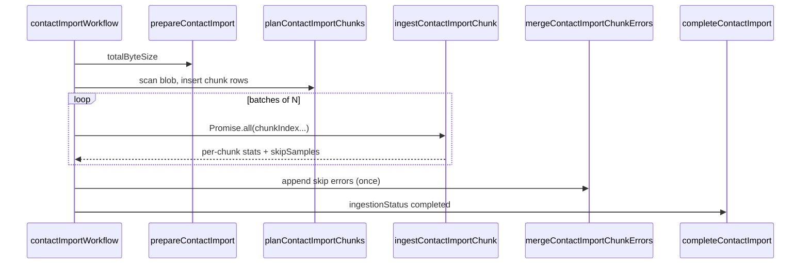

# Contact import: two-phase workflow with parallel chunk ingest

Review document — **not applied to the codebase yet**.

## Goals

1. **Phase 1 (prepare + plan):** fetch blob size, then scan the blob once to build **row-aligned byte ranges** (same `CHUNK_SIZE` + last-newline trim rule as today).
2. **Phase 2 (ingest):** run `ingestContactImportChunk` in parallel (e.g. `Promise.all` with a concurrency cap) using **fixed** `(byteStart, byteEndExclusive, chunkIndex)` — no shared `cursorByte` cursor.
3. **Idempotency:** each chunk can be retried independently without double-counting rows.
4. **Errors:** no concurrent `appendContactImportErrorEntries`; chunks return skip samples, one merge step appends them.

## Caveats (read before implementing)

| Topic | Note |
| --- | --- |
| **Quoted newlines in CSV** | Byte scanning and `lastIndexOf('\n')` treat `\n` inside quoted fields as row boundaries. Same limitation as the current sequential ingest. |
| **Workflow parallelism** | `Promise.all` only helps if your workflow runtime **schedules multiple `'use step'` invocations concurrently**. Confirm for Vercel Workflow; otherwise you still get correct behavior, just sequential execution. |
| **Counter drift on chunk retry** | Same as today: a chunk that partially flushes then retries may double-count up to one `BATCH_UPSERT_SIZE` in counters; contacts remain idempotent. |
| **`cursorByte` during run** | Becomes “bytes covered by **completed** chunks” (max `byteEndExclusive` of completed chunks), updated per chunk — useful for byte-based progress if you keep it in the UI. |

## Architecture



---

## 1. Schema (`schema.ts`)

Add types and a **per-chunk table** (avoids concurrent JSONB read-modify-write on one row).

```typescript
// After ContactImportErrorEntry / CONTACT_IMPORT_ERRORS_CAPACITY

export const contactImportChunkStatusEnum = pgEnum('contact_import_chunk_status', [
  'pending',
  'completed',
  'failed',
])

/**
 * One row per planned byte range. Created in phase 1; updated in phase 2.
 */
export const contactImportChunks = pgTable(
  'contact_import_chunks',
  {
    importId: uuid('import_id')
      .notNull()
      .references(() => contactImports.id, { onDelete: 'cascade' }),
    chunkIndex: integer('chunk_index').notNull(),
    byteStart: bigint('byte_start', { mode: 'number' }).notNull(),
    byteEndExclusive: bigint('byte_end_exclusive', { mode: 'number' }).notNull(),
    /**
     * 1-based row number of the first CSV record in this chunk (for skip error reporting).
     * Derived from newline counts during planning (see caveat above).
     */
    firstRowNumber: integer('first_row_number').notNull(),
    status: contactImportChunkStatusEnum('status').notNull().default('pending'),
    numberOfInspectedRows: integer('number_of_inspected_rows').notNull().default(0),
    numberOfIngestedRows: integer('number_of_ingested_rows').notNull().default(0),
    numberOfSkippedRows: integer('number_of_skipped_rows').notNull().default(0),
    completedAt: timestamp('completed_at'),
    createdAt: timestamp('created_at').notNull().defaultNow(),
    updatedAt: timestamp('updated_at').notNull().defaultNow(),
  },
  (t) => [
    primaryKey({ columns: [t.importId, t.chunkIndex] }),
    index('contact_import_chunks_import_status_idx').on(t.importId, t.status),
  ]
)

export type ContactImportChunk = typeof contactImportChunks.$inferSelect
```

Optional: document on `contactImports.cursorByte` that it is now **derived progress** (max completed `byteEndExclusive`), not the ingestion driver.

No change required to `contactImports` columns beyond comments unless you want `chunkCount` denormalized for the UI.

---

## 2. Migration (`drizzle-migrations/0007_contact_import_chunks.sql`)

Generate with `pnpm db:generate` after schema edit, or apply manually:

```sql
CREATE TYPE "public"."contact_import_chunk_status" AS ENUM('pending', 'completed', 'failed');

CREATE TABLE "contact_import_chunks" (
  "import_id" uuid NOT NULL,
  "chunk_index" integer NOT NULL,
  "byte_start" bigint NOT NULL,
  "byte_end_exclusive" bigint NOT NULL,
  "first_row_number" integer NOT NULL,
  "status" "contact_import_chunk_status" DEFAULT 'pending' NOT NULL,
  "number_of_inspected_rows" integer DEFAULT 0 NOT NULL,
  "number_of_ingested_rows" integer DEFAULT 0 NOT NULL,
  "number_of_skipped_rows" integer DEFAULT 0 NOT NULL,
  "completed_at" timestamp,
  "created_at" timestamp DEFAULT now() NOT NULL,
  "updated_at" timestamp DEFAULT now() NOT NULL,
  CONSTRAINT "contact_import_chunks_import_id_chunk_index_pk" PRIMARY KEY("import_id","chunk_index")
);

ALTER TABLE "contact_import_chunks"
  ADD CONSTRAINT "contact_import_chunks_import_id_contact_imports_id_fk"
  FOREIGN KEY ("import_id") REFERENCES "public"."contact_imports"("id")
  ON DELETE cascade ON UPDATE no action;

CREATE INDEX "contact_import_chunks_import_status_idx"
  ON "contact_import_chunks" USING btree ("import_id","status");
```

---

## 3. Shared constants (`workflows/contact-import.ts` top)

```typescript
const CHUNK_SIZE = 1024 * 1024 * 4
const BATCH_UPSERT_SIZE = 1000

/** Max concurrent chunk steps in phase 2. Tune for DB / blob rate limits. */
const PARALLEL_CHUNK_LIMIT = 4

type ChunkSkipSample = { rowNumber: number; reason: string }

type ChunkIngestResult = {
  chunkIndex: number
  inspected: number
  ingested: number
  skipped: number
  skipSamples: ChunkSkipSample[]
  byteEndExclusive: number
}
```

---

## 4. Helpers (new, same file)

```typescript
function countNewlinesInBuffer(buffer: Buffer): number {
  let count = 0
  for (let i = 0; i < buffer.length; i++) {
    if (buffer[i] === 0x0a) count += 1
  }
  return count
}

/**
 * Trim a fetched byte range to full lines (same rules as current ingest).
 * Returns trimmed buffer and consumed byte length from rangeStart.
 */
function trimChunkBufferToRowBoundary({
  buffer,
  rangeStart,
  rangeEndInclusive,
  totalByteSize,
}: {
  buffer: Buffer
  rangeStart: number
  rangeEndInclusive: number
  totalByteSize: number
}): { buffer: Buffer; consumed: number } {
  const isLastChunk = rangeEndInclusive >= totalByteSize - 1
  let consumed = buffer.length

  if (!isLastChunk) {
    const lastNewLine = buffer.lastIndexOf('\n')
    if (lastNewLine < 0) {
      failWorkflow(
        `Chunk has no newline; row exceeds chunk size at cursor ${rangeStart}`
      )
    }
    return {
      buffer: buffer.subarray(0, lastNewLine + 1),
      consumed: lastNewLine + 1,
    }
  }

  return { buffer, consumed }
}

async function loadChunkBoundaries({
  importId,
  chunkIndex,
}: {
  importId: string
  chunkIndex: number
}) {
  const [row] = await db
    .select()
    .from(contactImportChunks)
    .where(
      and(
        eq(contactImportChunks.importId, importId),
        eq(contactImportChunks.chunkIndex, chunkIndex)
      )
    )
    .limit(1)

  return row ?? null
}

/**
 * Advance parent import cursorByte to the max completed byte end (for progress UI).
 */
async function refreshContactImportCursorByte({
  importId,
}: {
  importId: string
}): Promise<void> {
  await db.execute(sql`
    UPDATE contact_imports ci
    SET
      cursor_byte = COALESCE((
        SELECT MAX(c.byte_end_exclusive)
        FROM contact_import_chunks c
        WHERE c.import_id = ${importId}
          AND c.status = 'completed'
      ), 0),
      updated_at = now()
    WHERE ci.id = ${importId}
  `)
}
```

---

## 5. Phase 1 — `planContactImportChunks` (new step)

Keeps `prepareContactImport` as-is (blob `head` + `totalByteSize`). Add this step after it.

```typescript
async function planContactImportChunks({
  importId,
}: {
  importId: string
}): Promise<{ chunkCount: number; status: 'created' | 'skipped' }> {
  'use step'

  const [job] = await db
    .select({
      blobUrl: contactImports.blobUrl,
      totalByteSize: contactImports.totalByteSize,
    })
    .from(contactImports)
    .where(eq(contactImports.id, importId))
    .limit(1)

  if (!job) {
    failWorkflow('Contact import not found')
  }

  if (job.totalByteSize <= 0) {
    failWorkflow('Contact import not prepared (totalByteSize)')
  }

  const existing = await db
    .select({ chunkIndex: contactImportChunks.chunkIndex })
    .from(contactImportChunks)
    .where(eq(contactImportChunks.importId, importId))
    .limit(1)

  if (existing.length > 0) {
    const [{ count }] = await db
      .select({ count: sql<number>`count(*)::int` })
      .from(contactImportChunks)
      .where(eq(contactImportChunks.importId, importId))
    return { chunkCount: count, status: 'skipped' }
  }

  let cursor = 0
  let chunkIndex = 0
  let firstRowNumber = 1
  const rows: (typeof contactImportChunks.$inferInsert)[] = []

  while (cursor < job.totalByteSize) {
    const rangeStart = cursor
    const rangeEndInclusive = Math.min(
      rangeStart + CHUNK_SIZE - 1,
      job.totalByteSize - 1
    )

    const chunkAsArrayBuffer = await fetchBlobChunkByRange({
      blobUrl: job.blobUrl,
      rangeStart,
      rangeEnd: rangeEndInclusive,
    })

    let buffer = Buffer.from(chunkAsArrayBuffer)
    const { buffer: trimmed, consumed } = trimChunkBufferToRowBoundary({
      buffer,
      rangeStart,
      rangeEndInclusive,
      totalByteSize: job.totalByteSize,
    })
    buffer = trimmed

    const byteEndExclusive = rangeStart + consumed
    const newlineCount = countNewlinesInBuffer(buffer)

    rows.push({
      importId,
      chunkIndex,
      byteStart: rangeStart,
      byteEndExclusive,
      firstRowNumber,
      status: 'pending',
    })

    firstRowNumber += newlineCount
    cursor = byteEndExclusive
    chunkIndex += 1
  }

  if (rows.length === 0) {
    failWorkflow('No chunks planned for import')
  }

  await db.insert(contactImportChunks).values(rows)

  return { chunkCount: rows.length, status: 'created' }
}
```

---

## 6. Phase 2 — refactor `ingestContactImportChunk`

**Signature change:** takes `chunkIndex`, reads boundaries from `contact_import_chunks`, does **not** read or advance `cursorByte` for routing.

```typescript
async function ingestContactImportChunk({
  importId,
  chunkIndex,
}: {
  importId: string
  chunkIndex: number
}): Promise<ChunkIngestResult> {
  'use step'

  const chunk = await loadChunkBoundaries({ importId, chunkIndex })
  if (!chunk) {
    failWorkflow(`Chunk ${chunkIndex} not found for import ${importId}`)
  }

  if (chunk.status === 'completed') {
    return {
      chunkIndex,
      inspected: chunk.numberOfInspectedRows,
      ingested: chunk.numberOfIngestedRows,
      skipped: chunk.numberOfSkippedRows,
      skipSamples: [],
      byteEndExclusive: chunk.byteEndExclusive,
    }
  }

  const [job] = await db
    .select()
    .from(contactImports)
    .where(eq(contactImports.id, importId))
    .limit(1)

  if (!job) {
    failWorkflow('Contact import not found')
  }

  const rangeStart = chunk.byteStart
  const rangeEndInclusive = chunk.byteEndExclusive - 1
  const isFirstChunk = rangeStart === 0
  const isLastChunk = chunk.byteEndExclusive >= job.totalByteSize

  const chunkAsArrayBuffer = await fetchBlobChunkByRange({
    blobUrl: job.blobUrl,
    rangeStart,
    rangeEnd: rangeEndInclusive,
  })

  let buffer = Buffer.from(chunkAsArrayBuffer)

  // Plan phase already stored row-aligned end; re-trim only if blob changed (defensive).
  if (buffer.length > 0 && !isLastChunk) {
    const lastNewLine = buffer.lastIndexOf('\n')
    if (lastNewLine < 0) {
      failWorkflow(
        `Chunk ${chunkIndex} has no newline at byte ${rangeStart}`
      )
    }
    buffer = buffer.subarray(0, lastNewLine + 1)
  }

  const columnHeaders = columnMappingRefsByIndex(job.columnMap).map(
    (c) => c.value
  )

  const parser = parse({
    columns: columnHeaders,
    skip_empty_lines: true,
    trim: true,
    bom: isFirstChunk,
    relax_column_count: true,
  })

  const pipe = Readable.from(buffer).pipe(parser)

  let batch: MappedContactImportRow[] = []
  let numberOfInspectedChunk = 0
  let numberOfIngestedChunk = 0
  let numberOfSkippedChunk = 0
  const skipSamples: ChunkSkipSample[] = []

  const flushBatch = async () => {
    if (batch.length === 0) return
    const { committed } = await flushContactImportBatch({
      tenantId: job.tenantId,
      listId: job.listId,
      rows: batch,
    })
    numberOfIngestedChunk += committed
    batch = []
  }

  for await (const record of pipe as AsyncIterable<Record<string, string>>) {
    numberOfInspectedChunk += 1
    const globalRowNumber =
      chunk.firstRowNumber + numberOfInspectedChunk - 1

    const mappedRow = mapContactImportRow({
      record,
      columnMap: job.columnMap,
    })

    if (mappedRow === null) {
      numberOfSkippedChunk += 1
      skipSamples.push({
        rowNumber: globalRowNumber,
        reason: 'Invalid email address',
      })
      continue
    }

    batch.push(mappedRow)
    if (batch.length >= BATCH_UPSERT_SIZE) {
      await flushBatch()
    }
  }
  await flushBatch()

  // Mark chunk completed + store per-chunk counters (idempotent unit of work).
  await db
    .update(contactImportChunks)
    .set({
      status: 'completed',
      numberOfInspectedRows: numberOfInspectedChunk,
      numberOfIngestedRows: numberOfIngestedChunk,
      numberOfSkippedRows: numberOfSkippedChunk,
      completedAt: sql`now()`,
      updatedAt: sql`now()`,
    })
    .where(
      and(
        eq(contactImportChunks.importId, importId),
        eq(contactImportChunks.chunkIndex, chunkIndex),
        eq(contactImportChunks.status, 'pending')
      )
    )

  // Roll up to parent import (atomic increments).
  await db
    .update(contactImports)
    .set({
      numberOfInspectedRows: sql`${contactImports.numberOfInspectedRows} + ${numberOfInspectedChunk}`,
      numberOfIngestedRows: sql`${contactImports.numberOfIngestedRows} + ${numberOfIngestedChunk}`,
      numberOfSkippedRows: sql`${contactImports.numberOfSkippedRows} + ${numberOfSkippedChunk}`,
      updatedAt: sql`now()`,
    })
    .where(eq(contactImports.id, importId))

  await refreshContactImportCursorByte({ importId })

  return {
    chunkIndex,
    inspected: numberOfInspectedChunk,
    ingested: numberOfIngestedChunk,
    skipped: numberOfSkippedChunk,
    skipSamples,
    byteEndExclusive: chunk.byteEndExclusive,
  }
}
```

**Important:** if the chunk `UPDATE ... WHERE status = 'pending'` affects 0 rows (concurrent duplicate), re-read chunk row and return early without rolling parent counters again — add a guard after the update:

```typescript
  const updatedChunks = await db
    .update(contactImportChunks)
    .set({ /* ... */ })
    .where(
      and(
        eq(contactImportChunks.importId, importId),
        eq(contactImportChunks.chunkIndex, chunkIndex),
        eq(contactImportChunks.status, 'pending')
      )
    )
    .returning({ chunkIndex: contactImportChunks.chunkIndex })

  if (updatedChunks.length === 0) {
    const done = await loadChunkBoundaries({ importId, chunkIndex })
    if (done?.status === 'completed') {
      return {
        chunkIndex,
        inspected: done.numberOfInspectedRows,
        ingested: done.numberOfIngestedRows,
        skipped: done.numberOfSkippedRows,
        skipSamples: [],
        byteEndExclusive: done.byteEndExclusive,
      }
    }
    failWorkflow(`Chunk ${chunkIndex} not pending and not completed`)
  }

  // THEN parent counter increment (only when chunk row transitioned pending → completed)
```

---

## 7. Merge skip errors (new step, after parallel ingest)

```typescript
async function mergeContactImportChunkErrors({
  importId,
  skipSamples,
}: {
  importId: string
  skipSamples: ChunkSkipSample[]
}): Promise<void> {
  'use step'

  if (skipSamples.length === 0) return

  // Stable order for UI
  skipSamples.sort((a, b) => a.rowNumber - b.rowNumber)

  await appendContactImportErrorEntries({
    importId,
    entries: skipSamples.map((s) => ({
      kind: 'skip' as const,
      rowNumber: s.rowNumber,
      reason: s.reason,
    })),
  })
}
```

Remove `appendContactImportErrorEntries` from inside `ingestContactImportChunk`.

---

## 8. Orchestrator — `contactImportWorkflow`

Replace the `while (true)` loop.

```typescript
async function ingestContactImportChunksInParallel({
  importId,
  chunkCount,
}: {
  importId: string
  chunkCount: number
}): Promise<ChunkSkipSample[]> {
  const allSkipSamples: ChunkSkipSample[] = []

  for (let start = 0; start < chunkCount; start += PARALLEL_CHUNK_LIMIT) {
    const end = Math.min(start + PARALLEL_CHUNK_LIMIT, chunkCount)
    const indices = Array.from(
      { length: end - start },
      (_, i) => start + i
    )

    const results = await Promise.all(
      indices.map((chunkIndex) =>
        ingestContactImportChunk({ importId, chunkIndex })
      )
    )

    for (const r of results) {
      allSkipSamples.push(...r.skipSamples)
    }
  }

  return allSkipSamples
}

export async function contactImportWorkflow({
  importId,
}: {
  importId: string
}) {
  'use workflow'

  try {
    await prepareContactImport({ importId })

    const { chunkCount } = await planContactImportChunks({ importId })

    const skipSamples = await ingestContactImportChunksInParallel({
      importId,
      chunkCount,
    })

    await mergeContactImportChunkErrors({ importId, skipSamples })

    // Ensure cursor reflects full file
    await db
      .update(contactImports)
      .set({
        cursorByte: sql`(SELECT total_byte_size FROM contact_imports WHERE id = ${importId})`,
        updatedAt: sql`now()`,
      })
      .where(eq(contactImports.id, importId))

    await completeContactImport({ importId })
  } catch (err: unknown) {
    const message = err instanceof Error ? err.message : String(err)
    await markContactImportAsFailed({ importId, message })
    throw err
  }
}
```

Optional: extract `ingestContactImportChunksInParallel` as its own `'use step'` if you want the batch loop itself durable — today it is inline in the workflow function (re-plans parallel batches on workflow replay; chunk steps remain idempotent).

---

## 9. Imports to add in `workflows/contact-import.ts`

```typescript
import {
  contacts,
  contactImports,
  contactImportChunks, // NEW
  // ...
} from '~/schema'
```

---

## 10. UI / API (optional, small)

Progress can stay row-based (`numberOfInspectedRows` / `numberOfIngestedRows`). If you want chunk-aware progress:

**`use-import-contacts-job.ts`** — optional fields (if you add a small API or join):

```typescript
// Optional: decode chunk progress from a new endpoint or extend existing GET
// chunksCompleted: number
// chunkCount: number
```

**Byte progress without schema change on parent:**

```typescript
// progressBytes ≈ cursorByte (already updated per completed chunk)
// progressRatio = totalByteSize > 0 ? cursorByte / totalByteSize : 0
```

No UI change is strictly required; `import-contacts-job.tsx` already shows row counts only.

---

## 11. Files to touch (checklist)

| File | Action |
| --- | --- |
| `schema.ts` | Add enum + `contactImportChunks` table |
| `drizzle-migrations/*` | `pnpm db:generate` + `pnpm db:migrate` |
| `workflows/contact-import.ts` | Full two-phase + parallel orchestration |
| `workflows/contact-import.ts` imports | `contactImportChunks`, `and` already imported |
| Tests (if any) | Add plan + parallel idempotency cases |

---

## 12. Test plan (manual)

1. Small CSV (&lt; 4MB) → single chunk, import completes.
2. Large CSV → multiple chunks; verify `contact_import_chunks` row count and `byteEndExclusive` of last chunk === `totalByteSize`.
3. Force retry of one chunk step (workflow replay) → chunk stays `completed`, parent counters not doubled.
4. Invalid emails in different chunks → `errors` JSON has **global** `rowNumber`s, sorted after merge.
5. Parallel limit: watch DB connection pool under `PARALLEL_CHUNK_LIMIT = 4`.

---

## 13. Rollout / migration of in-flight imports

Imports **already running** with the old cursor loop have no chunk rows. Options:

- Let them finish on old code path (deploy window), or
- One-time: if `contact_import_chunks` empty and `cursorByte > 0`, fail and ask user to re-upload, or
- Backfill plan from `cursorByte` (complex) — **not recommended**.

Safest: only new workflow runs after deploy use two-phase; drain old runs first.

---

## 14. Future improvements (out of scope)

- Extract `trimChunkBufferToRowBoundary` / fetch+plan loop into `lib/csv/contact-import-chunks.ts` for unit tests.
- Replace newline counting with a streaming CSV row scanner for multiline-safe `firstRowNumber`.
- Realtime tick per chunk completion (if you emit events today from `ingest` RETURNING).
